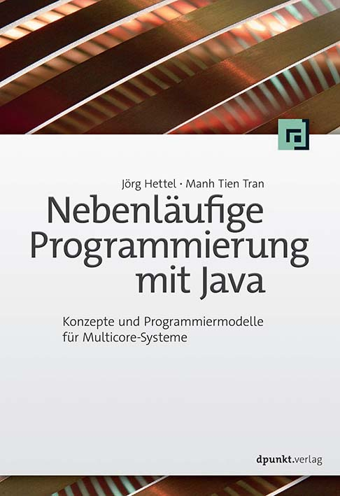

# Nebenläufige Programmierung mit Java
Das Repository enthält die Codebeispiele zum Buch "Nebenläufige Programmierung mit Java", dpunkt.verlag 2016

<a href="https://dpunkt.de/produkt/nebenlaeufige-programmierung-mit-java/" target="_blank">https://dpunkt.de/produkt/nebenlaeufige-programmierung-mit-java/</a>

